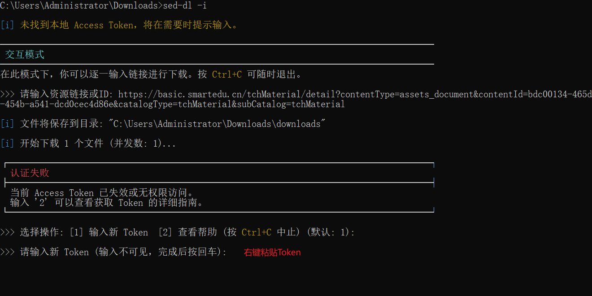

# 国家中小学智慧教育平台资源下载工具 (sed-dl)

<div align="center">

<p align="center">
    <a href="https://github.com/lss53/sed-dl/actions/workflows/release.yml">
        
    </a>
    <a href="https://github.com/lss53/sed-dl/releases/latest">
        
    </a>
    <a href="https://github.com/lss53/sed-dl/releases/latest">
        
    </a>
    <a href="https://opensource.org/licenses/MIT">
        
    </a>
</p>

**专为国家中小学智慧教育平台设计的强大命令行下载工具，基于 Rust 构建 🦀，简单高效，稳定可靠。**

</div>

---

`sed-dl` 旨在为教师、学生和家长提供便捷的离线资源下载方案，支持课程视频、电子教材及配套音频等多种资源类型，满足不同场景下的学习与教学需求。

## ✨ 核心功能

-   **全面解析**：支持同步课堂、精品课程、电子教材等多种资源类型。
-   **高效下载**：
    -   🚀 **并发下载**：支持多文件同时下载，充分利用网络带宽。
    -   🔄 **断点续传**：网络异常中断后，可自动恢复下载进度。
    -   ✅ **完整性校验**：通过 MD5 和文件大小校验，确保下载内容完整无误。
    -   **⏱️ 智能重试**：当服务器请求过于频繁时，能自动根据服务器指示进行等待和重试，下载更稳定。
-   **视频专项优化**：
    -   🎬 **M3U8 支持**：自动解析并合并加密视频流，输出为可在主流播放器中直接播放的完整 `.ts` 视频文件。
    -   📺 **多清晰度**：支持选择 1080p、720p 等不同画质。
-   **使用便捷**：
    -   🌳 **自动归类**：按学科、年级、版本等自动生成清晰的文件目录。
    -   ✍️ **规范命名**：自动过滤非法字符，生成整洁可读的文件名。
    -   🎨 **友好界面**：彩色进度提示与状态反馈，操作过程一目了然。
    -   **💡 智能识别**：交互模式下自动识别输入内容是 URL 还是资源 ID，无需手动切换。
-   **多模式操作**：
    -   **交互模式**：适合逐条输入链接或 ID，操作简单直观。
    -   **批量模式**：支持从文件读取多个链接，一次性完成下载任务。
    -   **命令行模式**：支持直接传入参数，便于集成或脚本调用。
-   **跨平台运行**：基于 Rust 编写，支持 Windows、macOS 和 Linux 系统。

## 📥 安装说明

### 方式一：下载预编译版本（推荐）

访问 [GitHub Releases](https://github.com/lss53/sed-dl/releases/latest) 页面，下载对应系统的可执行文件，解压后即可使用，无需配置额外环境。

为了方便使用，建议将解压后的可执行文件（`sed-dl.exe` 或 `sed-dl`）所在的目录添加到系统的**环境变量 `PATH`** 中。这样，您就可以在任何终端窗口直接运行 `sed-dl` 命令。

### 方式二：从源码构建

如果您未安装 Rust 环境，请先访问 [rustup.rs](https://rustup.rs/) 安装 Rust 工具链。

```bash
# 克隆项目
git clone https://github.com/lss53/sed-dl.git
cd sed-dl

# 编译发布版本
cargo build --release

# 编译结果位于 ./target/release/sed-dl
```

## 🔑 核心概念：Access Token

**什么是 Access Token？**
它是一串特殊的文本，相当于您登录平台后的“临时通行证”。程序需要使用这个 Token 来向服务器证明“您”有权限下载这些资源。

**如何获取？**
本工具内置了详细的指南。只需在终端运行以下命令，即可查看获取 Token 的详细步骤：
```bash
sed-dl --token-help
```
**手动获取（备选）**

使用 Chrome/Edge/Firefox 访问并登录 [国家中小学智慧教育平台](https://basic.smartedu.cn/tchMaterial)，打开任意一本教材后，按下图操作。


获取到的 Token 是一长串无规律的字母和数字。请妥善保管，不要泄露给他人。

**Token 如何工作？**
首次使用时，程序会提示您输入 Token。如果您选择保存，Token 会被安全地存储在本地配置文件中，后续无需再次输入。程序加载 Token 的优先级为：命令行 `--token` 参数 > `ACCESS_TOKEN` 环境变量 > 配置文件中的 Token。

## 🚀 使用指南

`sed-dl` 主要通过以下几种模式工作，您可以根据需要选择最合适的一种。

### 模式一：交互模式 (🌟 强烈推荐)

这是最简单、最灵活、最适合上手的模式。您可以在一个会话中逐一下载多个不同的资源。

-   **适用场景**：不确定要下载什么，想一个一个地尝试；或者需要下载来自不同课程的多个资源。
-   **启动命令**：
    ```bash
    sed-dl -i
    ```
-   **使用流程**：
    1.  程序启动后，会显示 `>>>` 提示符。
    2.  将您从浏览器地址栏复制的**资源链接**或**资源ID**粘贴进去，然后按回车。
    3.  程序会自动解析，并列出所有可下载的文件供您选择。
    4.  根据提示输入您想下载的文件的编号（例如 `1,3,5-8` 或 `all`）。
    5.  程序开始下载。下载完成后，会再次回到 `>>>` 提示符，等待您输入下一个链接。
    6.  想结束时，直接按回车或 `Ctrl+C` 即可退出。



### 模式二：单链接/ID 模式

直接、快速地下载指定链接或 ID 中的所有内容。

-   **适用场景**：目标明确，只想下载这一个页面的所有资源。
-   **命令格式**：
    -   **通过 URL 下载**：
        ```bash
        sed-dl --url "您要下载的资源的完整链接"
        ```
    -   **通过 ID 下载 (需要指定类型)**：
        ```bash
        sed-dl --id "资源的ID" --type <资源类型>
        ```
        *   `<资源类型>` 可选值: `tchMaterial` (教材), `qualityCourse` (精品课), `syncClassroom/classActivity` (同步课堂)。

### 模式三：批量下载模式

从一个文本文件中读取多个链接或 ID，一次性全部下载。

-   **适用场景**：整理了一批需要下载的资源，希望程序能自动依次处理。
-   **使用流程**：
    1.  创建一个文本文件，例如 `links.txt`。
    2.  将每个要下载的资源链接或 ID 单独放在一行。
        ```
        # links.txt 示例
        https://.../classActivity?activityId=...
        https://.../tchMaterial?contentId=...
        a1b2c3d4-....-....-....-e5f6g7h8i9j0
        ```
    3.  运行以下命令：
        ```bash
        sed-dl -b links.txt --type <资源类型>
        ```
        *   **注意**：即使文件中全是 URL，也建议提供 `--type` 参数。**若文件中包含资源 ID，则必须使用 `--type`。**

### ⚙️ 详细选项说明

您可以根据所选的模式，附加不同的选项来精确控制下载行为。**请注意，部分选项仅在特定模式下生效。**

| 选项 | 别名 | 描述和示例 |
| :--- | :--- | :--- |
| `--select <SELECTION>` | | **[非交互模式生效]** 直接指定下载项。此选项在 `--url`, `--id`, `-b` 模式下生效。支持 `all` 或 `1,3-5` 格式。默认值为 `all`。<br>**示例**: `sed-dl --url "..." --select "1-5,8"` |
| `--filter-ext <EXTS>` | | **[所有模式生效]** **按扩展名过滤**，只下载指定类型的文件。多个类型用逗号分隔，不区分大小写。<br>**示例**: `sed-dl --url "..." --filter-ext pdf,mp3` |
| `--video-quality <QUALITY>` | `-q` | **[非交互模式生效]** **选择视频清晰度**。可以是 `best` (最高)、`worst` (最低)，或具体的数值 (如 `720`)。在交互模式下，程序会提供一个交互式选择菜单。<br>**示例**: `sed-dl --url "..." --video-quality 720` |
| `--audio-format <FORMAT>` | | **[非交互模式生效]** **[教材模式]** 选择音频格式。通常是 `mp3` 或 `m4a`。在交互模式下，程序会提供一个交互式选择菜单。<br>**示例**: `sed-dl --url "..." --audio-format m4a` |
| `--force-redownload` | `-f` | **[所有模式生效]** **强制重新下载**。即使文件已存在且校验通过，也会强制覆盖下载。<br>**示例**: `sed-dl --url "..." -f` |
| `--workers <NUMBER>` | `-w` | **[所有模式生效]** **设置并发下载数**。根据您的网络情况调整，默认为 5。<br>**示例**: `sed-dl -b links.txt -w 10` |
| `--output <DIR>` | `-o` | **[所有模式生效]** **设置文件保存目录**。默认为程序运行目录下的 `downloads` 文件夹。<br>**示例**: `sed-dl -i -o "D:\学习资料"` |
| `--flat` | | **[所有模式生效]** **平铺目录结构**。所有文件直接下载到输出目录，不创建额外的子目录（如年级、学科等）。<br>**示例**: `sed-dl --url "..." --flat` |
| `--token <TOKEN>` | | **[所有模式生效]** **临时提供 Token**。通过此参数提供的 Token 优先级最高，但不会被保存。<br>**示例**: `sed-dl --url "..." --token "一长串token..."` |
| `--help` | `-h` | **[所有模式生效]** 显示此帮助信息并退出。|

## ⚠️ 注意事项

-   请合理使用本工具，尊重平台版权，下载资源仅限个人学习与研究。
-   `Access Token` 具有有效期，如遇 401 等认证错误，请重新获取。
-   本工具为开源项目，作者不对因使用本工具引发的任何问题负责。

## 🤝 参与贡献

欢迎提交问题反馈、功能建议或代码改进！

-   **报告问题**：请在 [GitHub Issues](https://github.com/lss53/sed-dl/issues) 提交 Bug 或建议。
-   **代码贡献**：欢迎 Fork 项目并提交 Pull Request，代码格式请遵循 `rustfmt` 规范。

## 📚 开源致谢

本项目使用了以下优秀开源项目的思路或代码：

-   [smartedu-download](https://github.com/52beijixing/smartedu-download)
-   [smartedu-dl-go](https://github.com/hantang/smartedu-dl-go)
-   [smartedu-dl-py](https://github.com/changsongyang/smartedu-dl-py)
-   [tchMaterial-parser](https://github.com/happycola233/tchMaterial-parser)
-   [FlyEduDownloader](https://github.com/cjhdevact/FlyEduDownloader)

## 📄 开源协议

本项目基于 [MIT License](LICENSE) 开源。

---

**免责声明**：本工具仅为个人学习与技术研究而开发，请勿用于商业用途。所有资源的版权归国家中小学智慧教育平台及相关权利方所有。